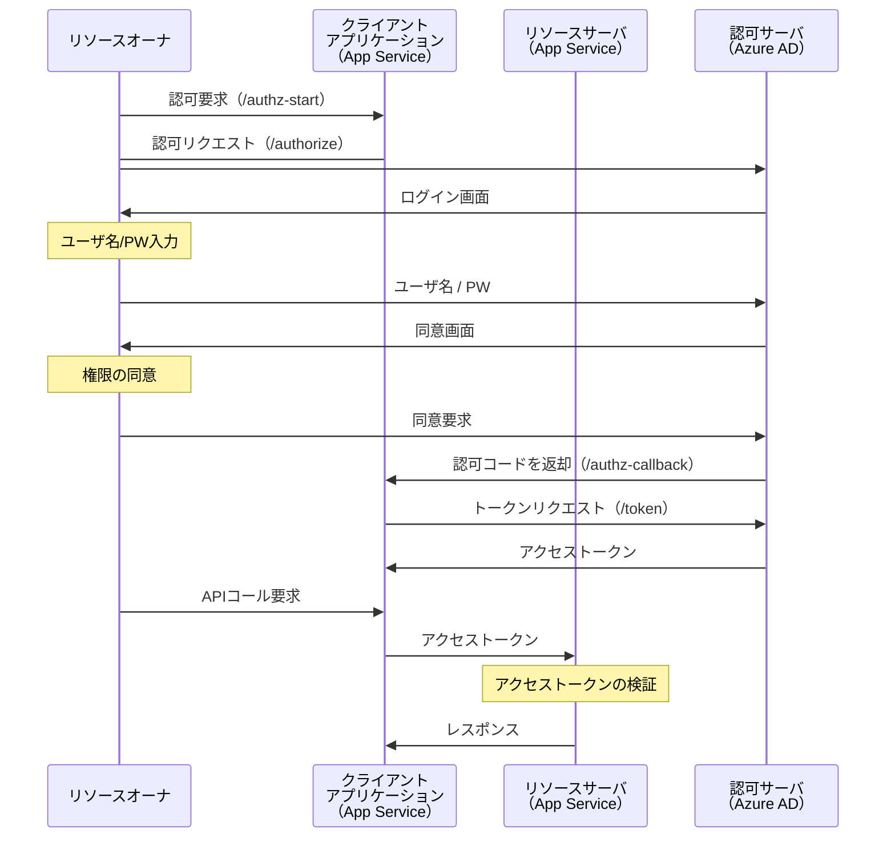

# 1. はじめに
昨今のシステムでは認証認可の仕組みを導入することは必須条件となっていますが、（私個人の見解では）認証認可の仕組みをドキュメントを読み込むだけで理解するのは難しいと思います。

そこで[NRI OpenStandia Advent Calendar 2022](https://qiita.com/advent-calendar/2022/nri-openstandia)の16日目は、少しでも認証認可の仕組みを理解していただくために Azure App Service と Azure AD を使用して OAuth 2.0 の認可コードフローを実装していこうと思います。

# 2. OAuth 2.0 と 認可コードフロー
まずは基本となる OAuth 2.0 の説明からです。[RFC 6749 (The OAuth 2.0 Authorization Framework)](https://openid-foundation-japan.github.io/rfc6749.ja.html)から引用します。

> OAuth 2.0 は, サードパーティーアプリケーションによるHTTPサービスへの限定的なアクセスを可能にする認可フレームワークである.

https://openid-foundation-japan.github.io/rfc6749.ja.html

[RFC 6749 (The OAuth 2.0 Authorization Framework)](https://openid-foundation-japan.github.io/rfc6749.ja.html) では4つの認可フローが定義されています。 
- 認可コードフロー
- インプリシットフロー
- リソースオーナー・パスワード・クレデンシャルズフロー
- クライアント・クレデンシャルフロー

今回はその中で[RFC 6749, 4.1. Authorization Code Grant](https://www.rfc-editor.org/rfc/rfc6749#section-4.1) で定義されている認可コードフローを実装してみます。認可コードフローは主にWebアプリケーションで使用される、以下のようなフローです。

1. クライアントから認可サーバに認可リクエストを投げ、認可コードを取得する。
1. その認可コードを用いて認可サーバにトークンリクエストを投げ、アクセストークンを取得する。

詳しくは[動画](https://www.youtube.com/watch?v=j0pIlZdD7-A)が公開されていますので、そちらをご参照ください。

# 3. 開発環境
本記事の開発環境は以下の通りです。

|環境|説明|備考|
|-|-|-|
|OS|Windows 10 Pro|
|Git Bash|2.37.1.windows.1|コマンドはGit Bashで実行します|
|Goのバージョン|1.18|1.19でも動作します|
|Azureアカウント|割愛|皆さんで用意してください|
|Azure CLI|2.34.0|

# 4. Azure App Service で OAuth2.0 認可コードフローを実装する

それでは実装に移ります。
ちなみに Azure App Service では組み込みの認証機能（Easy Auth (簡単認証) と呼ばれている）が提供されています。この機能を用いると最小限のコードを記載するだけで（もはや全く記載せずに）認証認可を実現することができます。

https://learn.microsoft.com/ja-jp/azure/app-service/overview-authentication-authorization

その仕組みを使い、画面上で操作するだけで認証認可の仕組みを実現できてしまうことは非常に嬉しいのですが、そのままだと「何か認証できた」という状態で留まってしまい実際にどのようなフローで認証が行われているのか、そもそも OAuth 2.0 や OIDC（OpenID Connect）とは何か、といった理解が乏しいままになってしまう可能性があります。

そのため今回はその機能を使用しません。また初めの一歩ということで今回は OAuth2.0（認可）のフローを実装していこうと思います。

## 4.1. 全体フロー

OAuth 2.0 の認可コードフローの登場人物として、
* リソースオーナ
* クライアントアプリケーション
* リソースサーバ
* 認可サーバ

が存在します。今回、その登場人物を使用して実現する認可コードフローの全体像は以下の通りです。



## 4.2. 認可サーバ（Azure AD） にアプリを登録する

アプリケーションの実装に入る前に、認可サーバ（Azure AD） にアプリを登録する必要があります。
Azure ポータルの「Azure Active Directory」> 「アプリの登録」>「新規登録」から任意の名前でアプリケーションを登録します。今回は Go言語を用いてアプリケーションを開発するため、`golang-app`としています。


ここでリダイレクトURI（省略可能）を入力する欄がありますが、ここは Azure AD でのログインが成功した後にリダイレクトされるURIになります。今回はそのリダイレクト先を`/authz-callback`で用意する予定のため、そのように設定しています。

:::note info
アプリの登録が完了した後、実装の際に使用する値があるため忘れずにメモしておきましょう。
- Azure ADのディレクトリ（テナント）ID
- アプリケーション（クライアント）ID
- クライアントシークレット（「証明書とシークレット」> 「クライアントシークレット」から生成できます）
:::

## 4.3. アプリケーションの実装

それではアプリケーションの実装に移ります。
2022年10月、Linux版での Azure App Service においてGo言語のサポートがなされました。現在は`1.18`及び`1.19`のバージョンにおいて実験的に使用できます。

私は普段 Java や C# を用いて開発していますが、最近サポートされたということもあり今回はGo言語を使用してみます。

https://azure.github.io/AppService/2022/10/12/Go-on-AppService.html

また、今回は[4.1.全体フロー](#41-全体フロー)で登場しているクライアントアプリケーションとリソースサーバは同じ App Service とさせていただきます。（本来は別の方が理解しやすいかもしれないですが、、）

### 4.3.1. 準備

Go言語でのアプリ開発の準備を行います。まずはプロジェクト用のディレクトリを作成し、`go mod init`を使って`go.mod`を生成します。
```bash
$ mkdir app
$ cd app/
$ go mod init app
go: creating new go.mod: module app
$ cat go.mod
module app

go 1.18
```
次にプロジェクト直下に`main.go`を作成します。準備段階では特に実装しなくても良いですが、今回は慣れるために
- `http://localhost:8080`を開くと`Hello,`を表示
- `http://localhost:8080/world`を開くと`Hello, world`を表示

するようなアプリケーションを開発しておきます。

```go:main.go
package main

import (
	"fmt"
	"net/http"
)

func main() {
	http.HandleFunc("/", HelloServer)
	http.ListenAndServe(":8080", nil)
}

func HelloServer(w http.ResponseWriter, r *http.Request) {
	fmt.Fprintf(w, "Hello, %s!", r.URL.Path[1:])
}
```
以上です。`go run main.go`を実行することでブラウザで動作確認ができます。

### 4.3.2. クライアントアプリケーションの実装
それでは本題です。クライアントアプリケーションを実装します。

まずは認可サーバにリクエストを送信する（認可前の）画面です。認可要求するためのボタンだけ配置します。以下は「認可要求」ボタンが押下されると`/authz-start`に遷移するような画面です。

```html:html/index.html
<!doctype html>
<html lang="ja">
<head>
  <meta charset="UTF-8">
  <title>Welcome</title>
</head>
<body>
  <div class="main">
    <h1>認可前のページ</h1>
    <div>
      <button type="button" onclick="location.href='./authz-start'">認可要求</button>
    </div>
  </div>
</body>
</html>
```

続いて、アクセストークン取得後のページを実装します。
今回 Azure AD で生成されたアクセストークンはCookieに入れて画面に返却され、リソースサーバのAPIを呼ぶ際にはそのアクセストークンを`Authorization`ヘッダにつけて送信するように実装を行います。
リソースサーバのAPIは 2つ、`/read`と`/read-write`を用意し、実行権限の有無を`result`として返却します。分かりやすいように画面ではその結果を表示するようにしています。

```html:html/top.html
<!doctype html>
<html lang="ja">
<head>
  <meta charset="UTF-8">
  <title>Welcome</title>
</head>
<body>
  <h1>アクセストークン取得後のページ</h1>
  <button onclick="handleClickRead()">API実行（権限あり）</button>
  <button onclick="handleClickReadWrite()">API実行（権限なし）</button>
  <div id="result"></div>
  <script type="text/javascript">
    var cookieArray = new Array();
    if(document.cookie != ''){
        var tmp = document.cookie.split('; ');
        for(var i = 0; i < tmp.length; i++){
            var data = tmp[i].split('=');
            cookieArray[data[0]] = decodeURIComponent(data[1]);
        }
    }

    function handleClickRead() {
      callApi("/read");
    }

    function handleClickReadWrite() {
      callApi("/read-write");
    }

    async function callApi(url) {
      const res = await fetch(url, {
        headers: {
          Authorization: cookieArray['AUTH_ACCESS_TOKEN'],
          Accept: "application/json",
          "Content-Type": "application/json;charset=utf-8"
        }
      });
      const json = await res.json();
      const el = document.getElementById("result")
      el.innerHTML = json.result
    }
  </script>
</body>
</html>
```

続いて、それぞれ適切なパスで各ページに遷移するようにします。

```go:main.go
// 認可前のページ
func handleIndex(w http.ResponseWriter, r *http.Request) {
	t, _ := template.ParseFiles("html/index.html")
	t.Execute(w, nil)
}

// アクセストークン取得後のページ
func handleTop(w http.ResponseWriter, r *http.Request) {
	t, _ := template.ParseFiles("html/top.html")
	t.Execute(w, nil)
}

func main() {

	port := "8080"
	log.Println("webサーバを起動しました。(ポート：" + port + ")")

	http.HandleFunc("/", handleIndex)
	http.HandleFunc("/top", handleTop)

	http.ListenAndServe(":"+port, nil)
}
```
画面の実装は以上です。サーバを起動し、`http://localhost:8080/`にアクセスすると「認可前のページ」が、`http://localhost:8080/top`にアクセスすると「アクセストークン取得後のページ」が表示されます。


まずは`html/index.html`で実装したように、認可を開始した際に呼び出されるエンドポイント（`/authz-start`）を実装します。
この関数の戻りとして、Azure AD の認可エンドポイントにリダイレクトする必要があります。

Azure AD の認可エンドポイントは`https://login.microsoftonline.com/<テナントID>/oauth2/v2.0/authorize`であり、パラメータはMicrosoftのドキュメントに記載されています。ここでは詳細な説明は割愛しますが、詳しいパラメータについては以下をご参照ください。

https://learn.microsoft.com/ja-jp/azure/active-directory/develop/v2-oauth2-auth-code-flow#request-an-authorization-code

```go:main.go
func handleAuthzStart(w http.ResponseWriter, r *http.Request) {

	tenantId := os.Getenv("AUTH_TENANT_ID")
	clientId := os.Getenv("AUTH_CLIENT_ID")
	scope := os.Getenv("AUTH_SCOPE")
	redirectUri := os.Getenv("AUTH_REDIRECT_URI")

	state, _ := uuid.NewUUID()

	authorizeEndpointUrl := fmt.Sprintf(`https://login.microsoftonline.com/%s/oauth2/v2.0/authorize
		?client_id=%s
		&response_type=code
		&response_mode=query
		&state=%s
		&scope=%s
		&redirect_uri=%s
		`, tenantId, clientId, state, scope, redirectUri)

	// 認可エンドポイントにリダイレクト
	http.Redirect(w, r, authorizeEndpointUrl, http.StatusFound)
}

func main() {

	port := "8080"
	log.Println("webサーバを起動しました。(ポート：" + port + ")")

	http.HandleFunc("/", handleIndex)
	http.HandleFunc("/top", handleTop)
	http.HandleFunc("/authz-start", handleAuthzStart)

	http.ListenAndServe(":"+port, nil)
}
```
ここでは以下のような処理を行っています。
* `/authz-start`でアクセスしたら`handleAuthzStart`関数がコールされる。
* Azure AD の認可エンドポイントを叩くために必要なパラメータを環境変数から取得する。
* 各種パラメータを付与した状態で認可エンドポイントにリダイレクトする。

続いて、Azure AD でログインが成功し、コールバックされるエンドポイント（`/authz-callback`）を実装します。先に実装を以下に示します。
```go:main.go
type TokenEndPointResponse struct {
	AccessToken string `json:"access_token"`
	TokenType   string `json:"token_type"`
	ExpiresIn   int    `json:"expires_in"`
	Scope       string `json:"scope"`
}

func handleAuthzCallback(w http.ResponseWriter, r *http.Request) {
	var tokenEndPointResponse TokenEndPointResponse

	tenantId := os.Getenv("AUTH_TENANT_ID")
	clientId := os.Getenv("AUTH_CLIENT_ID")
	clientSecret := os.Getenv("AUTH_CLIENT_SECRET")
	redirectUri := os.Getenv("AUTH_REDIRECT_URI")

	// 認可コードを取得
	authorization_code := r.URL.Query().Get("code")

	// トークンエンドポイントからアクセストークンを取得
	tokenEndPointUrl := fmt.Sprintf("https://login.microsoftonline.com/%s/oauth2/v2.0/token", tenantId)
	form := url.Values{}
	form.Add("client_id", clientId)
	form.Add("client_secret", clientSecret)
	form.Add("code", authorization_code)
	form.Add("redirect_uri", redirectUri)
	form.Add("grant_type", "authorization_code")

	body := strings.NewReader(form.Encode())
	req, err := http.NewRequest("POST", tokenEndPointUrl, body)
	if err != nil {
		log.Fatal(err)
	}
	req.Header.Set("Content-Type", "application/x-www-form-urlencoded")
	req.Header.Set("Restrict-Access-To-Tenants", tenantId)
	client := new(http.Client)
	res, err := client.Do(req)
	if err != nil {
		log.Fatal(err)
	}
	defer res.Body.Close()

	if res.StatusCode != 200 {
		dump, _ := httputil.DumpResponse(res, true)
		fmt.Printf("%q", dump)
		return
	}

	resBody, _ := io.ReadAll(res.Body)
	if err := json.Unmarshal(resBody, &tokenEndPointResponse); err != nil {
		fmt.Println(err)
		return
	}

	// アクセストークンをCookieに格納
	cookieAccessToken := &http.Cookie{
		Name:  "AUTH_ACCESS_TOKEN",
		Value: tokenEndPointResponse.AccessToken,
		Path:  "/",
	}
	http.SetCookie(w, cookieAccessToken)

	// Topページにリダイレクト
	topEndPointUrl := "/top"
	http.Redirect(w, r, topEndPointUrl, http.StatusFound)
}

func main() {

	port := "8080"
	log.Println("webサーバを起動しました。(ポート：" + port + ")")

	http.HandleFunc("/", handleIndex)
	http.HandleFunc("/top", handleTop)
	http.HandleFunc("/authz-start", handleAuthzStart)
	http.HandleFunc("/authz-callback", handleAuthzCallback)

	http.ListenAndServe(":"+port, nil)
}
```
ここでは以下の処理を行っています。
* トークンエンドポイント（`https://login.microsoftonline.com/<テナントID>/oauth2/v2.0/token`）を叩くために必要なパラメータを環境変数から取得する。
* クエリパラメータに`code`として送信された認可コードを取得する。
* トークンエンドポイントにリクエストを投げ、アクセストークンを取得する。
* 取得したアクセストークンをCookie（`AUTH_ACCESS_TOKEN`）に格納し、認証後のページ`/top`にリダイレクトする。

ポイントは認可エンドポイントからリダイレクトされた際にパラメータとして渡される`code`が認可コードであることと、それを用いてアクセストークンを取得する部分です。

トークンエンドポイントに関するパラメータの仕様については以下をご参照ください。

https://learn.microsoft.com/ja-jp/azure/active-directory/develop/v2-oauth2-auth-code-flow#request-an-access-token-with-a-client_secret

:::note info
トークンエンドポイントに対してアクセストークンを要求する際には`クライアントシークレット`を使用する方法と`証明書資格情報`を使用する方法があります。
:::

クライアントアプリケーションの実装は以上です。

### 4.3.3. リソースサーバの実装

次に、リソースサーバで受け付けるAPIを実装します。
APIは画面側でも記載した通り、2つ、`/read`と`/read-write`を用意します。
それぞれ、リクエストの`Authorization`ヘッダに格納されているアクセストークンの中身の`scp`（認可エンドポイント`scope`に渡した権限）を取得し、以下の権限が存在しているかチェックします。

|エンドポイント|権限|
|-|-|
|/read|Mail.Read|
|/read-write|Mail.ReadWrite|

レスポンスは、以下のように返却します。
* 権限が存在している場合：「APIコール成功!!!（権限あり）」
* 権限が存在していない場合：「APIコール失敗,,,（権限なし）」

処理はほとんど同じなため、`/read`のエンドポイントのみ実装を以下に示します。
```go:main.go
// Mail.Readの権限を保持していればOK
func handleRead(w http.ResponseWriter, r *http.Request) {
	// Authorizationヘッダからアクセストークンを取得
	accessToken := r.Header.Get("Authorization")

	// アクセストークン（JWT）からscp（scope）を取得（処理は割愛）
	scope := decodeJwtPayloadScope(accessToken)

	// 権限にMail.Readが含まれていればOK、含まれていなければNGの文言を返却
	isCall := contains(scope, "Mail.Read")
	var res Response
	if isCall {
		res.Result = "APIコール成功!!!（権限あり）"
	} else {
		res.Result = "APIコール失敗,,,（権限なし）"
	}
	output, _ := json.Marshal(res)
	w.Write(output)
}

// Mail.ReadWriteの権限を保持していればOK（Mail.ReadだけではNG）
func handleReadWrite(w http.ResponseWriter, r *http.Request) {
	// 省略
}

func main() {

	port := "8080"
	log.Println("webサーバを起動しました。(ポート：" + port + ")")

	http.HandleFunc("/", handleIndex)
	http.HandleFunc("/top", handleTop)
	http.HandleFunc("/authz-start", handleAuthzStart)
	http.HandleFunc("/authz-callback", handleAuthzCallback)
	http.HandleFunc("/read", handleRead)
    http.HandleFunc("/read-write", handleReadWrite)

	http.ListenAndServe(":"+port, nil)
}
```

これにて、リソースサーバの実装は終了です。

## 4.4. 動作確認
では動作確認してみます。まず、環境変数は以下で設定します。
|環境変数|値|
|-|-|
|AUTH_TENANT_ID|  Azure AD のテナントID |
|AUTH_CLIENT_ID| [4.2 認可サーバ（Azure AD） にアプリを登録する](#42-認可サーバazure-ad-にアプリを登録する) で登録したアプリのアプリケーションID |
|AUTH_CLIENT_SECRET|   [4.2 認可サーバ（Azure AD） にアプリを登録する](#42-認可サーバazure-ad-にアプリを登録する)で登録したアプリのクライアントシークレット |
|AUTH_SCOPE| `https://graph.microsoft.com/mail.read` <br> ※ `/read`APIには権限があるように設定しています|
|AUTH_REDIRECT_URI| `http://localhost:8080/authz-callback` |

アプリケーションを起動後、`http://localhost:8080/`にアクセスし「認可要求」ボタンを押下すると Azure AD のログイン画面にリダイレクトされます。


ユーザ名 / パスワードを入力すると Azure AD から権限の同意画面が表示されます。

同意すると、リダイレクトURI（`/authz-callback`）にリクエストされ、アクセストークンを取得した上でアクセストークン取得後のページ（`/top`）に遷移します。
その後、API実行ボタンを押下すると今回は`/read`APIにのみ権限が付与されているため、以下のような挙動となります。


開発者ツールを見ると、想定通りAPIの実行の際、`Authorization`ヘッダにアクセストークンが付与されています。
また、アクセストークンは[JWT](https://jwt.io/)で作成されているため、どのような情報が入っているかは以下のサイトにコピペすることで確認ができます。

https://jwt.io/

今回のアクセストークンの中身（一部）は以下のようになってました。`scp`クレームに`Mail.Read`が含まれており、`Mail.ReadWrite`は含まれていないことが分かるため、APIの権限制御も想定通りに動いています。
```
{
  "aud": "https://graph.microsoft.com",
  "iss": "https://sts.windows.net/<テナントID>/",
  "iat": 1671061553,
  "nbf": 1671061553,
  "exp": 1671067032,
  ・・・省略・・・
  "scp": "Mail.Read openid profile email",
  "sub": "UuxN3ms0cqqmPgyFPLzxTBD7iBvYe0fHyBiyytZKPAM",
  ・・・省略・・・
}
```
以上で、アプリケーションの動作確認が取れました！！

## 4.5. Azure App Service にデプロイ
[4.3.で開発したアプリケーション](#43-アプリケーションの実装)をAzure App Serviceにデプロイします。

今回はAzure CLIを使用してデプロイします。まずは`az login`を用いてAzureにログインします（すでにログインしている場合には不要です）。
```bash
$ az login
```

次にアプリケーションをデプロイします。`az webapp up`コマンドを使用することでローカルのワークスペースからアプリをデプロイすることができます。必要に応じてオプションを追加した状態で実行します。

```bash
$ az webapp up --location japaneast --name golang-app --resource-group rg-golang-app --plan golang-app-asp --runtime GO:1.18 --sku B1 --os Linux
```
今回使用したオプションは以下となります。
|オプション|説明|
|-|-|
|`--location`|デプロイする場所（地域）を指定します。|
|`--name`|App Serviceの名前を指定します。指定しない場合はランダムな名前が生成されます。|
|`--resource-group`|アプリが属するリソースグループを指定します。|
|`--plan`|アプリに関連付けられているApp Service プランを指定します。|
|`--runtime`|アプリで実行される Go のバージョンを指定します。|
|`--sku`|App Service プランのサイズとコストを定義します。使用できる値については[App Serviceの価格](https://azure.microsoft.com/ja-jp/pricing/details/app-service/linux/)を参照してください。|
|`--os`|作成するアプリのOSを指定します。 Goの場合はLinuxしかサポートされていません。|

:::note info
その他の`az webapp up`コマンドの説明やオプションについては以下に記載されています。
https://learn.microsoft.com/ja-jp/cli/azure/webapp?view=azure-cli-latest#az-webapp-up
:::

## 4.6. デプロイしたアプリで動作確認する
先程デプロイしたアプリを Azure で動作確認してみます。
まずはデプロイに関してですが、以下のように Azure ポータルで確認できればデプロイは成功しています。


続いて、Azure AD に登録されているアプリでリダイレクトURIを追加しておきます。

次にApp Service の「構成」> 「アプリケーション設定」から環境変数を設定し、アプリケーションを再起動します。各環境変数は以下のように設定します。
|環境変数|値|
|-|-|
|AUTH_TENANT_ID|  Azure AD のテナントID |
|AUTH_CLIENT_ID| [4.2 認可サーバ（Azure AD） にアプリを登録する](#42-認可サーバazure-ad-にアプリを登録する) で登録したアプリのアプリケーションID |
|AUTH_CLIENT_SECRET|   [4.2 認可サーバ（Azure AD） にアプリを登録する](#42-認可サーバazure-ad-にアプリを登録する)で登録したアプリのクライアントシークレット |
|AUTH_SCOPE| `https://graph.microsoft.com/mail.read` <br> ※ `/read`APIには権限があるように設定しています|
|AUTH_REDIRECT_URI| `https://golang-app.azurewebsites.net/authz-callback` |


再起動後、`https://<App Serviceの名前>.azurewebsites.net/`にブラウザでアクセスすると動作確認ができます。
ローカルでの場合と同様にAPIの実行まで確認できれば動作確認は完了です。

以上で、Azure App Service で実行されたアプリケーションで Azure AD を用いてOAuth 2.0 の認可コードフローを実現できました。

# 5. おわりに

いかがでしたでしょうか。この記事では、Azure App Service と Azure AD を使用して OAuth 2.0 の認可コードフローを実現する方法についてご紹介しました。
今回は認可サーバとして Azure AD を利用しましたが、Keycloakといったオープンソースを利用して自前で認可サーバを構築するとさらに理解が深まると思います。

この記事が少しでも皆さんのお役に立ったなら嬉しいです。最後まで読んでいただきありがとうございました。

# 6. 参考文献
- [OAuth 2.0 全フローの図解と動画](https://qiita.com/TakahikoKawasaki/items/200951e5b5929f840a1f)
- [Go Web アプリを Azure App Service に配置する](https://learn.microsoft.com/ja-jp/azure/app-service/quickstart-golang)
- [GoのWebアプリをAzure App Serviceにデプロイする](https://qiita.com/qt-luigi/items/e8a21b09238d9c75e228)
- [Microsoft ID プラットフォームと OAuth 2.0 認証コード フロー](https://learn.microsoft.com/ja-jp/azure/active-directory/develop/v2-oauth2-auth-code-flow)

